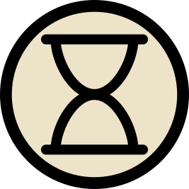

# Secret Histories

Unofficial print&play card boardgame for 2-3 players based on the [Cultist Simulator](https://store.steampowered.com/app/718670/Cultist_Simulator/) video game. Average play time is somewhere between 2-3 hours.

## Game description

Secret Histories is card-heavy boardgame designed for 3 players. The main mechanics, borrowing from BoardGameGeek terminology, are:
- Race: Players race to achieve immortality through an occult ritual. Whoever performs an ascension ritual first wins the game. Players need to gather occult lore, influence and ingredient of the right principle and strength.
- Action Points/Action drafting: There are 4 types of actions a player can do: Work, Study, Dream and Talk. But they can only do 3 unique ones each round. Additionally, some actions are picked from a shared limited pool.
- Hand Management/Push Your Luck/Player Elimination: Players fall under effects of powerful yet temporary "influences." And not all of them are good. As seasons change, they must careful manage their mental state or risk succumbing to ill effects entirely. You can always play it safe but takes time that you don't always have. And if that wasn't enough, the authorities don't take kindly to the occult activities either.
- Hidden Information: Many key pieces for final ritual are obtained secretly. Victory won't come out of the blue but it is not always clear how close an individual player is.
- Temporary Cards: Influences are fickle in their nature.
- Auction: Some end-game pieces for the ascension are auctioned among the player. Prepare to pay a hefty price for the final piece of the puzzle.

## I want to play right now!

*Note: Check out digital version below if you have Tabletop Simulator on Steam.*

The game is in a testing phase so the delivery mechanism is work in progress.  I will probably have Github release with PDFs in near future. If you still desperately need to play right now, you will need to do some work yourself. First of all, you will need [python 3](https://www.python.org/downloads/) installed with following packages: [FPDF](https://pypi.org/project/fpdf/) and [Pillow](https://pypi.org/project/pillow/). From the root of this repo run:
- `python cards.py`

This will take around 2 minutes and generate `export/SecretHistories.pdf`, ~65 page A4 PDF file with 9 cards per page. You can print this, I strongly recommend in color, and do a little bit of crafting to cut out the individual cards. "Perhaps [the Forge of Days](https://cultistsimulator.fandom.com/wiki/The_Forge_of_Days) Hour will notice you 😉". There is 1px spacing between the cards. The cards are designed to fit in 60mmx90mm sleeves.

Then there is [Rules Word document](Rules.docx). Print or keep around digitally.

Finally, the game uses various tokens in addition to cards. I haven't figured out a great way to manufacture these yet. I would recommend borrowing cubes or paper tokens from other board games. One of the tokens is the game currency "funds". These in particular should be easy to find in your collection, any currency representation with single digit scale will do. You will need following tokens types and amounts:
- Time: ~45 
- Society: ~7 for each player (distinct)   
- Funds: Players will own around 20 worth of funds if they are rich, likely way less   

Do note that the art for the tokens is there so if you want to get creative and create them yourself, more power to you and let me know how you did it 🥰

## Digital version

I have made a work in progress [Tabletop Simulator mod of this game](https://steamcommunity.com/sharedfiles/filedetails/?id=3479818565).

## Licensing

I do not own the rights for Cultist Simulator game, its assets and the excellent fictional world it takes place in. This is a fan project to try and play with my boardgame group of friends. The majority of assets for the cards were ripped out of the PC game and occasionally modified to suit this boardgame needs. On the other hand, they are also available publicly at the [Cultist Simulator wiki](https://cultistsimulator.fandom.com/). If you are from Weather Factory and reading this, let's figure out a kickstarter!